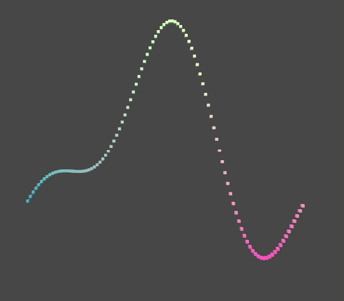

# Unity 2D Graph Simulation – Learning Project & Tutorial

This is a learning project based on Jasper Flick’s [Catlike Coding Unity tutorials](https://catlikecoding.com/unity/tutorials/).
This project is a part of my Unity learning journey, focused on understanding **basic GameObject manipulation** and **C# scripting**.  
It implements a **2D Graph Simulation** using cubes in Unity that shows various wave simulations (Single Wave, Multi Wave, and Ripple Wave).

---

## 📚 What I Learned

This project helped me understand and apply:

- ✅ Creating a Prefab
- ✅ Instantiate Multiple Cube from said Prefab
- ✅ Visualize Mathematical Function using Cubes
- ✅ Create Surface Shader and Shader Graph
- ✅ Animating the Graph by adding time dimensionn to the function
- ✅ Create a function library
- ✅ Using delegate for alternating between functions

---

## 🎓 Purpose

This is part of a personal learning portfolio.  
The goal is to **document my progress in graphics programming with Unity** — starting from beginner-friendly concepts like this clock, and eventually moving toward shaders, physics, and custom rendering.

---

## 🕹️ Project Overview

- Create Cube Prefab
- Instantiate multiple cubes
- Visualize Mathematical Function with cubes
- Animating Graph

---

## 💼 Portfolio Use

This repository is part of my programming and Unity development portfolio.  
All code was written and structured by me based on basic Unity documentation and experimentation.

I’ll continue adding more projects to showcase my growth — each with its own GitHub repository and learning summary.

---

## 🔧 Tools Used

- Unity 2022+ (Built-in Render Pipeline)
- Visual Studio Code
- Git & GitHub for version control
